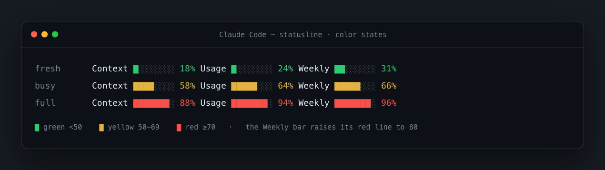
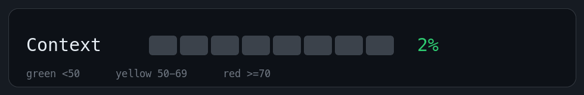

# claude-statusline

**English** · [简体中文](README.zh-CN.md)

A colored, informative status line for [Claude Code](https://claude.com/claude-code) — model, directory & git branch, and live **context / 5-hour / weekly** usage with reset countdowns. One installer that **auto-detects [Vibe Island](https://vibeisland.app)** and keeps its notch display working.


[](LICENSE)

> **中文 TL;DR：** Claude Code 自带 `statusLine` 接口——指一个脚本，Claude Code 每条消息把一份 JSON（模型、上下文占用、用量额度…）喂给它的标准输入，脚本打印什么终端底部就显示什么。本仓库就是这么一个脚本 + 一键安装器：装一次、跑一次，自动判断你这台有没有装 Vibe Island，选对方式导入。换电脑照样一行命令。

---

## What you get

```
Opus 4.8 (1M context)  myproject git:(main)
Context ███░░░░░ 42%   Usage ████░░░░ 58% (2h05m)   Weekly ██████░░ 82% (40h00m)
```

- **Model · directory · git branch**
- **Context** window used %
- **Usage** — your rolling 5-hour limit, with time-to-reset
- **Weekly** — your 7-day limit, with time-to-reset
- Bars **and** numbers are color-coded by load: emerald green `<50`, yellow `50–69`, red `≥70` (the Weekly bar raises its red line to `80`).

All data comes from Claude Code itself (the `rate_limits` field it passes to status lines) — **no external service or API key required.**

### Color coding

Bars **and** numbers shift with load — emerald `<50`, amber `50–69`, red `≥70` (the Weekly bar holds off red until `80`):



<p align="center"></p>

## Install

```bash
git clone https://github.com/kesh19801992/claude-statusline ~/.claude/skills/claude-statusline
bash ~/.claude/skills/claude-statusline/install.sh
```

Then reopen Claude Code (or send any message) — the bar appears at the bottom.

Because it's also a **Claude Code skill**, once cloned you can just type `/claude-statusline` inside Claude Code and it will run the installer for you.

The installer auto-detects your machine:

| Your machine | What the installer does |
| --- | --- |
| **Has Vibe Island** | Appends the render block (wrapped in markers) to the end of `~/.vibe-island/bin/vibe-island-statusline`. The notch keeps working; `statusLine.command` is left untouched. |
| **No Vibe Island** | Writes `~/.claude/statusline.sh` and registers it in `~/.claude/settings.json`. |

It **backs up** every file it touches (`*.bak.<timestamp>`), is **idempotent** (re-running replaces its managed block instead of duplicating), and prints a preview when done.

### Requirements

- [`jq`](https://jqlang.github.io/jq/) — required. macOS: `brew install jq`; Debian/Ubuntu: `sudo apt-get install -y jq`.
- `git` — optional, only used for the branch segment.
- A **truecolor** terminal for the exact emerald green (Ghostty, iTerm2, modern terminals). Others fall back to the nearest color.

## How it works

Claude Code runs the program named in `statusLine.command` on every assistant message and pipes it a JSON object on **stdin**:

```jsonc
{
  "model":          { "display_name": "Opus 4.8 (1M context)" },
  "context_window": { "used_percentage": 42 },
  "rate_limits":    { "five_hour": { "used_percentage": 58, "resets_at": 1782085800 },
                      "seven_day": { "used_percentage": 82, "resets_at": 1782327600 } },
  "cwd": "…", "version": "…", "cost": { "total_cost_usd": … }
  // …
}
```

`statusline-body.sh` reads those fields and prints two colored lines to **stdout**. That's the whole mechanism — the installer just wires the body into the right place for your machine.

## Customize

Edit `statusline-body.sh`, then re-run `install.sh` to apply.

- **Colors** — see `_csl_clr`: green is `\033[38;2;46;204;113m` (emerald, truecolor), yellow `\033[33m`, red `\033[31m`.
- **Thresholds** — each bar takes optional `[yellow] [red]` args. Defaults are `50 70`; the Weekly bar passes `50 80`.
- **Bar width** — the `8` argument to `_csl_bar`.
- **Add segments** — the input JSON also exposes `.cost.total_cost_usd`, `.version`, `.effort`, `.fast_mode`; add them to the output lines if you like.

## Update

```bash
cd ~/.claude/skills/claude-statusline && git pull && bash install.sh
```

## Uninstall

- **Standalone mode:** remove the `statusLine` key from `~/.claude/settings.json` (a timestamped backup sits next to it), and delete `~/.claude/statusline.sh`.
- **Vibe Island mode:** delete the block between the `# >>> claude-statusline … >>>` and `# <<< claude-statusline … <<<` markers in `~/.vibe-island/bin/vibe-island-statusline`, or restore the newest `*.bak.*` backup beside it.

## Contributing

Issues and PRs welcome — see [CONTRIBUTING.md](CONTRIBUTING.md) for commit conventions ([Conventional Commits](https://www.conventionalcommits.org/)) and dev/test steps.

## Credits

Built to live happily alongside [Vibe Island](https://vibeisland.app), which already bridges Claude Code's `rate_limits` into a notch display — this skill reuses the same data and renders it in the terminal too.

## License

[MIT](LICENSE) © 2026 kesh19801992
