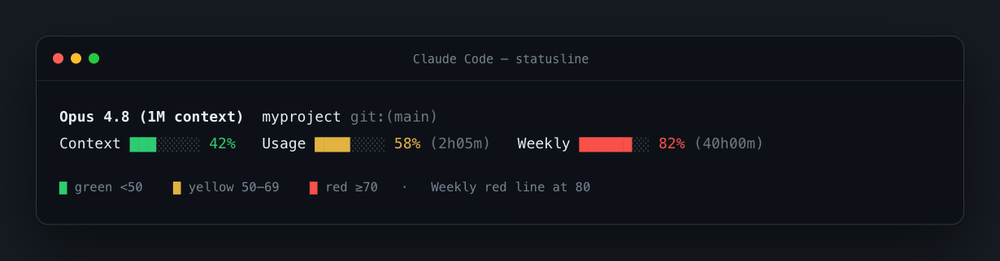

# claude-statusline

[English](README.md) · **简体中文**

给 [Claude Code](https://claude.com/claude-code) 的彩色状态栏——显示模型、目录与 git 分支，以及实时的 **上下文 / 5 小时 / 每周** 用量和重置倒计时。一个安装器**自动检测 [Vibe Island](https://vibeisland.app)**，并保持它的刘海显示照常工作。



[](LICENSE)

---

## 显示什么

```
Opus 4.8 (1M context)  myproject git:(main)
Context ███░░░░░ 42%   Usage ████░░░░ 58% (2h05m)   Weekly ██████░░ 82% (40h00m)
```

- **模型 · 目录 · git 分支**
- **Context** 上下文窗口占用百分比
- **Usage** —— 你的 5 小时滚动额度，带距重置时间
- **Weekly** —— 你的 7 天周额度，带距重置时间
- 进度条**和**数字都按占用着色：翠绿 `<50`、黄 `50–69`、红 `≥70`（Weekly 条的红线提到 `80`）。

所有数据都来自 Claude Code 本身（它喂给状态栏的 `rate_limits` 字段）——**无需任何外部服务或 API key。**

## 安装

```bash
git clone https://github.com/kesh19801992/claude-statusline ~/.claude/skills/claude-statusline
bash ~/.claude/skills/claude-statusline/install.sh
```

然后重开 Claude Code（或发任意一条消息）——状态栏就出现在底部。

因为它同时也是个 **Claude Code 技能**，克隆后你可以直接在 Claude Code 里输入 `/claude-statusline`，它会帮你跑安装器。

安装器自动判断你的机器：

| 你的机器 | 安装器的动作 |
| --- | --- |
| **装了 Vibe Island** | 把渲染块（带标记包裹）追加到 `~/.vibe-island/bin/vibe-island-statusline` 末尾。刘海照常工作，`statusLine.command` 不动。 |
| **没装 Vibe Island** | 写入 `~/.claude/statusline.sh` 并在 `~/.claude/settings.json` 里注册。 |

它会**备份**每个改动的文件（`*.bak.<时间戳>`）、**幂等**（重复运行只替换托管块、不重复），并在结束时打印预览。

### 依赖

- [`jq`](https://jqlang.github.io/jq/) —— 必需。macOS：`brew install jq`；Debian/Ubuntu：`sudo apt-get install -y jq`。
- `git` —— 可选，仅用于分支段。
- 想要精确的翠绿色需 **truecolor（24 位色）终端**（Ghostty、iTerm2、现代终端）。其他终端会回退到最接近的颜色。

## 原理

Claude Code 每条助手消息都会运行 `statusLine.command` 指向的程序，并把一份 JSON 从 **stdin** 喂进去：

```jsonc
{
  "model":          { "display_name": "Opus 4.8 (1M context)" },
  "context_window": { "used_percentage": 42 },
  "rate_limits":    { "five_hour": { "used_percentage": 58, "resets_at": 1782085800 },
                      "seven_day": { "used_percentage": 82, "resets_at": 1782327600 } },
  "cwd": "…", "version": "…", "cost": { "total_cost_usd": … }
  // …
}
```

`statusline-body.sh` 读取这些字段，把两行彩色文本打到 **stdout**。整个机制就这么简单——安装器只是把这段渲染接到你机器上正确的位置。

## 自定义

编辑 `statusline-body.sh`，然后重跑 `install.sh` 生效。

- **颜色** —— 见 `_csl_clr`：绿是 `\033[38;2;46;204;113m`（翠绿，truecolor），黄 `\033[33m`，红 `\033[31m`。
- **阈值** —— 每根条接受可选的 `[yellow] [red]` 参数。默认 `50 70`；Weekly 条传的是 `50 80`。
- **条宽** —— `_csl_bar` 的 `8` 这个参数。
- **加字段** —— 输入 JSON 还有 `.cost.total_cost_usd`、`.version`、`.effort`、`.fast_mode`，想要可以加到输出行里。

## 更新

```bash
cd ~/.claude/skills/claude-statusline && git pull && bash install.sh
```

## 卸载

- **独立模式：** 从 `~/.claude/settings.json` 删掉 `statusLine` 键（旁边有带时间戳的备份），并删除 `~/.claude/statusline.sh`。
- **Vibe Island 模式：** 删掉 `~/.vibe-island/bin/vibe-island-statusline` 里 `# >>> claude-statusline … >>>` 与 `# <<< claude-statusline … <<<` 标记之间的内容，或还原旁边最新的 `*.bak.*` 备份。

## 致谢

本工具与 [Vibe Island](https://vibeisland.app) 协同工作——后者已经把 Claude Code 的 `rate_limits` 桥接到刘海显示，本技能复用同一份数据，也把它渲染到终端里。

## 许可证

[MIT](LICENSE) © 2026 kesh19801992
